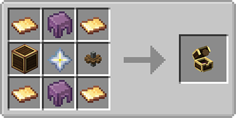
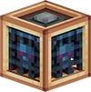
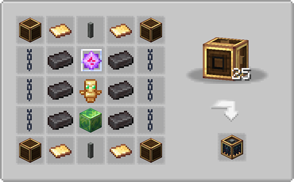

  

  

# ⚙️ Create: Mob Spawners
An addon for the [Create](https://github.com/Creators-of-Create/Create) mod for Minecraft. It adds a tool that can catch mobs which can then be placed into a spawner. It aims to be "immersive" by making use of the base game magic components.

## 🆕 What does it add?
### Soul Catcher

The Soul Catcher is a new item that can capture a mob's soul.
For this to work, the mob needs to have an active weakness effect which could be applied using a throwable potion of weakness.
Mobs that should not be capturable can be adjusted in the config. Bosses are not capturable by design.

It can be crafted using this recipe:

This is how it looks ingame:

### Mechanical Spawner

The Mechanical Spawner is a new kinetic block that can spawn mobs according to the Soul Catcher placed inside.
For this to work, it needs rotational force and a supply of potion of regeneration (as liquid pumped into the block).

It can be crafted in a 5x5 Mechanical Crafter grid using this recipe:

This is how it looks ingame:

